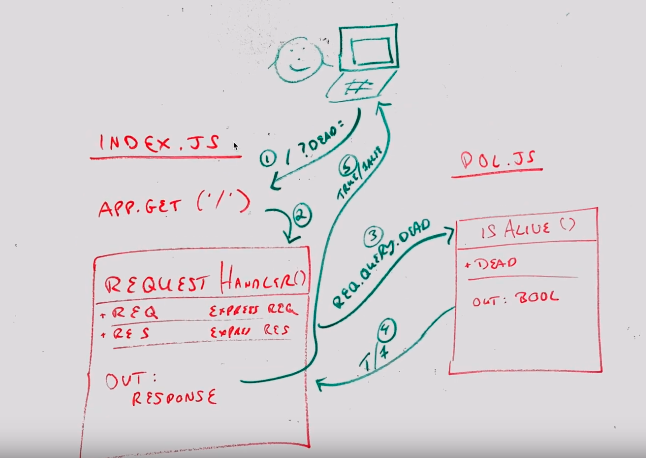

# LAB - 00

## Proof of Life Server

### Author: Sian Culligan

### Links and Resources

- [submission PR](https://github.com/sian-401-advanced-javascript/lab-00/pull/1)
- [travis](https://travis-ci.com/github/sian-401-advanced-javascript/lab-00) 
- [front-end application](https://sian-lab-00.herokuapp.com/)

#### Documentation
- [jsdoc](https://sian-lab-00.herokuapp.com/docs)

### Modules
#### `pos.js`
##### Exported values & methods

###### `isAlive(dead) -> boolean`
Return true/false to indicate how the server works

### Setup
#### `.env` requirements (where applicable)
- export PORT=3000

#### How to initialize/run your application (where applicable)
- `npm start`
- Endpoint: `/`
    * Returns a boolean
- Endpoint: `/docs`
    * Returns JSDocs documentation page

#### Tests

- How do you run tests? `npm test`
- Lint tests: `nom run lint`

#### UML
- 
